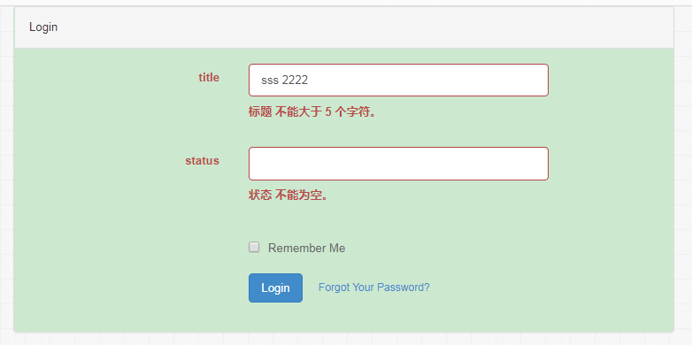

# validation
本工具简单封装了Illuminate\Validation 使其使用起来更加方便 ，需要new一个表单 添加rules 等

composer文件代码：
---
```php
    "sunny/validation":"dev-master"
```

使用方法：
1、先构造一个需要验证的类testForm
---
```php
class TestForm extends Libs\Tools\Form
{
    public function __construct($data)
    {
        parent::__construct($data);
    }

    public function rules()
    {
        return [
            'title' => 'required|string|min:2|max:5',
            'status' => 'required|integer'
        ];
    }
}
```

2、调用：
---
```php
  $data = [
            'title' => '123457',
            'status' => 'werwer',
        ];

        $validator = (new TestForm($data))->make();
        if ($validator->fails()) {
            echo 'fail' . "<br>";
            foreach ($validator->errors()->getMessages() as $key => $error) {
                echo $error[0] . "<br>";
            }
        } else {
            echo 'ok';
        }
```

3、运行效果图
---


4、添加自定义验证
---
完整的form例子如下：
```php
use Libs\Tools\Form;

class TestForm extends Form
{
    public function __construct($data)
    {
        parent::__construct($data);
        $this->extend();
    }

    public function rules()
    {
        return [
            'title' => 'required|string|min:2|max:5',
            'status' => 'required|integer',
            'test' => 'required|string|foo'
        ];
    }
    public function attributes()
    {
        return [
            'status'=>'状态',
            'test'=>'测试',
        ]; // TODO: Change the autogenerated stub
    }

    public function messages()
    {
        return [
            'foo' => ':attribute 不等于foo',
        ]; // TODO: Change the autogenerated stub
    }

    public function extend(){
        $this->_valid->extend('foo', function ($attribute, $value, $parameters) {
            return $value == 'foo';
        });
    }
}
```
 
 例子二
 ---
 ```php
 $data = [
         'title' => '123457', 'status' => 'werwer',
         'test' => 'fooddd'
     ];

     $validator = (new TestForm($data))->make();
     if ($validator->fails()) {
         $this->assign('errors', $validator->errors());
     } else {
         echo 'ok';
     }
     $this->assign('form', $data);

     $this->display();
```
```html
<!DOCTYPE HTML>
<html>
<head>
    <meta charset="UTF-8">
    <title>form</title>
    <link href="https://cdn.bootcss.com/bootstrap/3.3.7/css/bootstrap.min.css" rel="stylesheet">
</head>
<body>
<div class="container">
    <div class="row">
        <div class="col-md-8 col-md-offset-2">
            <div class="panel panel-default">
                <div class="panel-heading">Login</div>
                <div class="panel-body">
                    <form class="form-horizontal"  method="POST" action="">

                        <div class="form-group {$errors->has('title') ? ' has-error' : ''}">
                            <label for="title" class="col-md-4 control-label">title</label>

                            <div class="col-md-6">
                                <input id="title" type="text" class="form-control" name="title" value="{$form.title}">

                                <php>if($errors->has('title')){
                                    //echo $errors->first('title');
                                </php>
                                    <span class="help-block">
                                        <strong>{$errors->first('title')}</strong>
                                    </span>
                                <php>}</php>
                            </div>
                        </div>

                        <div class="form-group {$errors->has('status') ? ' has-error' : ''}">
                            <label for="password" class="col-md-4 control-label">status</label>

                            <div class="col-md-6">
                                <input id="password" type="text" class="form-control" name="status" value="{$form.status}">

                                <php>if($errors->has('status')){</php>
                                    <span class="help-block">
                                        <strong>{$errors->first('status')}</strong>
                                    </span>
                                <php>}</php>
                            </div>
                        </div>

                        <div class="form-group">
                            <div class="col-md-6 col-md-offset-4">
                                <div class="checkbox">
                                    <label>
                                        <input type="checkbox" name="remember"> Remember Me
                                    </label>
                                </div>
                            </div>
                        </div>

                        <div class="form-group">
                            <div class="col-md-6 col-md-offset-4">
                                <button type="submit" class="btn btn-primary">
                                    <i class="fa fa-btn fa-sign-in"></i> Login
                                </button>

                                <a class="btn btn-link" href="{{ url('/password/reset') }}">Forgot Your Password?</a>
                            </div>
                        </div>
                    </form>
                </div>
            </div>
        </div>
    </div>
</div>
</body>
</html>

```
运行效果图
 ---
 
更多用户请参考：
 [laravel validation](https://docs.golaravel.com/docs/5.0/validation/ "laravel validation")