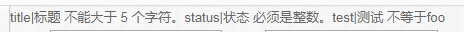

# validation
本工具简单封装了Illuminate\Validation 使其使用起来更加方便 ，需要new一个表单 添加rules 等

composer文件代码：
```php
    "sunny/validation":"dev-master"
```

使用方法：
1、先构造一个需要验证的类testForm
```php
class TestForm extends Libs\Tools\Form
{
    public function __construct($data)
    {
        parent::__construct($data);
    }

    public function rules()
    {
        return [
            'title' => 'required|string|min:2|max:5',
            'status' => 'required|integer'
        ];
    }
}
```

2、调用：
```php
  $data = [
            'title' => '123457',
            'status' => 'werwer',
        ];

        $validator = (new TestForm($data))->make();
        if ($validator->fails()) {
            echo 'fail' . "<br>";
            foreach ($validator->errors()->getMessages() as $key => $error) {
                echo $error[0] . "<br>";
            }
        } else {
            echo 'ok';
        }
```



 
更多用户请参考：
 [laravel validation](https://docs.golaravel.com/docs/5.0/validation/ "laravel validation")